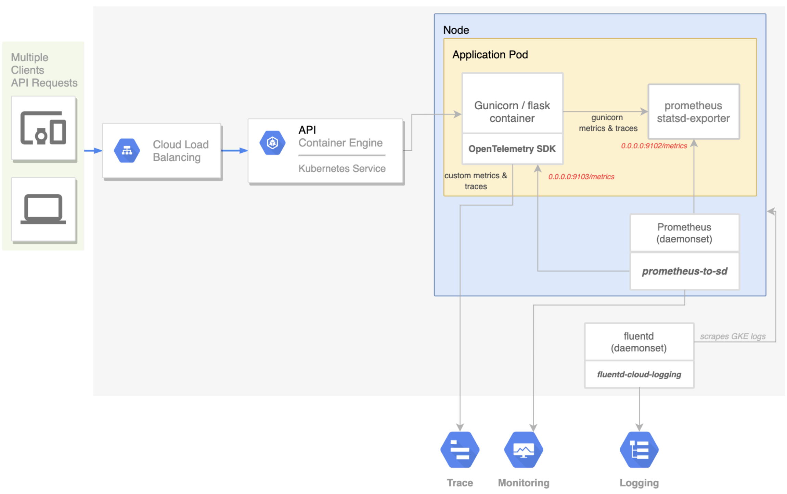

# Gunicorn Flask application with OpenTelemetry instrumentation

This repository is a POC application to demonstrate OpenTelemetry instrumentation for a `gunicorn` application running on Google Kubernetes engine.

In this design:

-   `gunicorn` is configured to forward framework metrics to a Prometheus `statsd-exporter` (sidecar container).

-   `OpenTelemetry` agent is deployed as a `daemonset` and configured with:

    -   A Prometheus `receiver` to scrape the `statsd-exporter` metrics (drop-in replacement for a full-fledged Prometheus instance).

    -   An OpenCensus `receiver` to receive the application custom metrics sent via the SDK.

    -   A `Cloud Trace` and `Cloud Monitoring` `exporter` to ship metrics and traces to Cloud Operations.

-   `OpenTelemetry SDK` for Python is used within the app and `OpenCensusMetricsExporter` and `OpenCensusSpanExporter` are configured to export custom metrics and spans to the OpenTelemetry agent.

-   `Prometheus` and `prometheus-to-sd` are not used.

The architecture is as follows:



## Installation

### Create a GKE Cluster

Enable the container API:

```sh
gcloud services enable container.googleapis.com
```

Create a GKE cluster:

```sh
gcloud container clusters create <CLUSTER_NAME> \
  --enable-autoupgrade \
  --enable-autoscaling --min-nodes=3 --max-nodes=10 --num-nodes=5 \
  --zone=<ZONE>
```

Verify that the cluster is up-and-running:

```sh
kubectl get nodes
```

### Enable Google Container Registry

Enable Google Container Registry (GCR) on your GCP project:

```sh
gcloud services enable containerregistry.googleapis.com
```

and configure the `docker` CLI to authenticate to GCR:

```sh
gcloud auth configure-docker -q
```

### Build and deploy everything

Install skaffold and run:

    skaffold run --default-repo=gcr.io/[PROJECT_ID]

where [PROJECT_ID] is your GCP project ID where you will push container images to.

This command:

-   builds the container images
-   pushes them to GCR
-   applies the `./kubernetes-manifests` deploying the application to
    Kubernetes.

**Troubleshooting:** If you get "No space left on device" error on Google
Cloud Shell, you can build the images on Google Cloud Build: [Enable the
Cloud Build
API](https://console.cloud.google.com/flows/enableapi?apiid=cloudbuild.googleapis.com),
then run `skaffold run -p gcb --default-repo=gcr.io/[PROJECT_ID]` instead.

### Observe the results

Find the IP address of your application, then visit the application on your browser to confirm installation.

    kubectl get service flask-app-tutorial

**Troubleshooting:** A Kubernetes bug (will be fixed in 1.12) combined with
a Skaffold [bug](https://github.com/GoogleContainerTools/skaffold/issues/887)
causes load balancer to not to work even after getting an IP address. If you
are seeing this, run `kubectl get service flask-app-tutorial -o=yaml | kubectl apply -f-`
to trigger load balancer reconfiguration.

The above command deploys the following services:

| Service                                                | Language       | Description                                                                                                                                    |
| ------------------------------------------------------ | -------------- | ---------------------------------------------------------------------------------------------------------------------------------------------- |
| [custom-metrics-example](./src/custom-metrics-example) | Python         | Generates a custom metric named 'custom-metrics-example'                                                                                       |
| [flask-app](./src/flask-app)                           | Python (Flask) | Simple Flask application with a single endpoint '/' instrumentized (metrics and traces) with the Flask extension for OpenTelemetry Python SDK. |
| [loadtester](./src/loadtester)                         | Python         | Locust master / workers that generate a load on the Flask application in order to get frequent metric / trace writes.                          |
