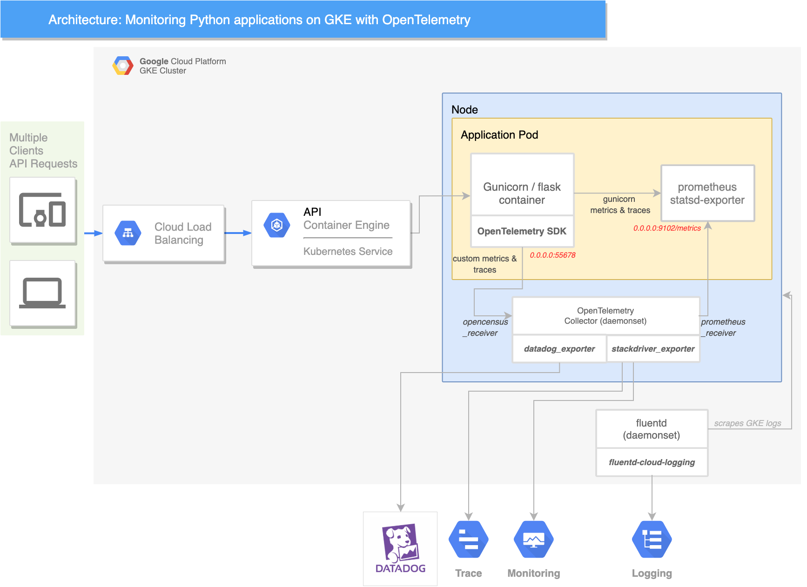

# Gunicorn Flask application with OpenTelemetry instrumentation

This repository is a POC application to demonstrate OpenTelemetry instrumentation for a gunicorn application running on GKE, including framework metrics and traces as well as custom metrics and traces.

The metrics backend configured in this repository is Cloud Monitoring (ex Stackdriver), but modifying the ot-agent.yaml configuration should be straightforward to adapt this example to other metrics or trace backends.

This branch can deploy the architecture below:

## Installation

The installation steps below assume you already have a running GKE cluster.

### Build and deploy the gunicorn application

    cd flask-app
    gcloud builds submit --tag=gcr.io/<YOUR_PROJECT_ID>/flask-app:<VERSION>

Update the version of the app in `app.yaml`, then deploy the app:

    kubectl apply -f app.yaml

### Deploy the OpenTelemetry agent

    cd ops/opentelemetry
    kubectl apply -f ot-agent.yaml

To change the configuration of the agent, refer to the configuration [documentation](https://opentelemetry.io/docs/collector/configuration/) and edit the `ot-agent.yaml`'s `ConfigMap` resource.

### Deploy the loadtester

    cd loadtester
    gcloud builds submit --tag=gcr.io/<YOUR_PROJECT>/loadtester:<VERSION>
    kubectl apply -f k8s/locust_master_controller.yaml
    kubectl apply -f k8s/locust_master_service.yaml

Set the `LOCUST_MASTER` env variable in `k8s/locust_worker_controller.yaml` and apply it:

    kubectl apply -f k8s/locust_worker_controller.yaml
